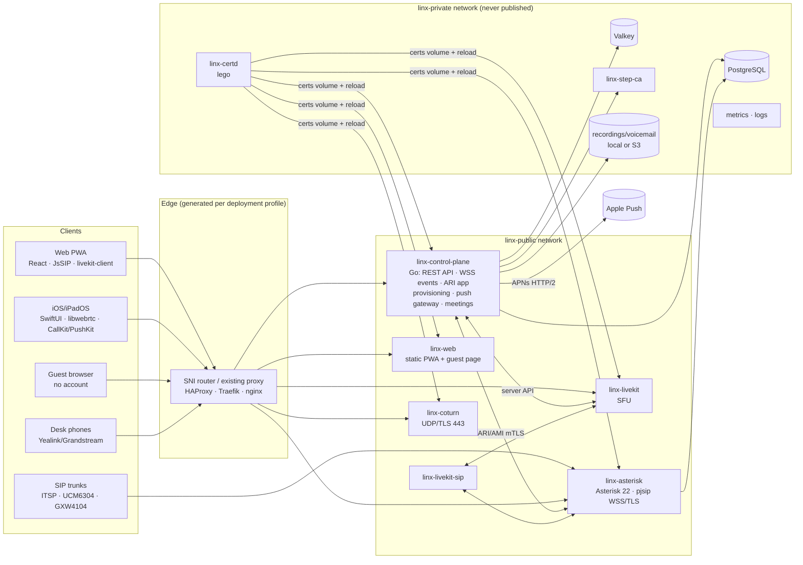
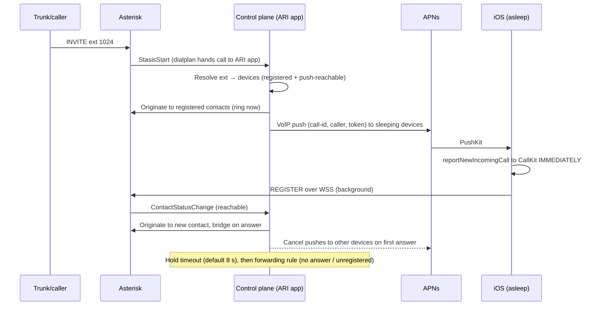

# Linx — Architecture

Self-hosted unified communications for homes and small businesses: a PBX, video meetings, guest links, and presence. Scope for this build: **server + Web + iOS/iPadOS**. The design lets Android, macOS and Windows be added later without server changes. Decisions are referenced as `ADR-xxx` (see `DECISIONS.md`).

## 1. Components



| Service | Role | Tech |
|---|---|---|
| `linx-control-plane` | REST API (OpenAPI 3.1) and webhooks. Handles auth (OIDC, local + TOTP/WebAuthn), RBAC, tenants, users, extensions, devices, enrollment, meetings/guest tokens, presence hub, push gateway (APNs now, FCM interface), directory, CDR ingestion, routing wizard compiler, and ARI Stasis app | Go |
| `linx-asterisk` | Call control and media anchor for PBX calls: WSS/TLS transports, queues, voicemail, MOH, park, recording | Asterisk 22 LTS |
| `linx-livekit` / `linx-livekit-sip` | Meetings (SFU with E2EE) and SIP dial-in bridge | LiveKit |
| `linx-coturn` | STUN/TURN on UDP 443 and TLS 443 (3478/5349 in the container; the front door maps 443), with time-limited REST credentials, relaying only to Asterisk on `linx-media` | coturn (official image + Linx entrypoint) |
| `linx-web` | Static PWA: user app, admin console, separate guest entry (under 300 KB) | React/Vite, served by a minimal static server |
| `linx-certd` | Public ACME certificates, renewal, deployment, expiry metrics | Go + lego |
| `linx-step-ca` | Internal PKI (service mTLS, device certificates) | step-ca |
| `linx-postgres`, `linx-valkey` | Data and pub-sub (Valkey is optional on Lite) | PostgreSQL 17, Valkey 8 |
| `linx-sni` | SNI router on 443, only for profiles C and G(b) | HAProxy |
| `linx` CLI | `setup`, `doctor`, `upgrade`, `backup`, `restore` | Go (same module) |

**Deferred (interfaces reserved):**
- tunnel gateway and client tunnel core (ADR-007/008)
- site-to-site agent
- Whisper/LLM workers
- WhatsApp/Telegram channel workers
- MCP server

## 2. Hostnames and exposure

Default hostnames sit under one base domain chosen in the setup wizard.

| Host | Carries | Proxy mode | Public at proxy? |
|---|---|---|---|
| `admin.` | Admin console | HTTP (terminated) | LAN/VPN by default; SSO + MFA if exposed |
| `meet.` | Guest join, meeting UI, click-to-call | HTTP | **Public** (the platform does its own auth) |
| `api.` | REST, WSS events, SIP-over-WSS (routed to Asterisk), LiveKit signalling | HTTP/WSS | **Public** |
| `provision.` | Enrollment API, desk-phone configs (Phase 4) | HTTP | Public (token/MAC auth) |
| `sip.` | SIP/TLS 5061-equivalent for trunks and desk phones | **TLS passthrough** | Allowlisted source IPs |
| `turn.` | TURN/TLS | **TLS passthrough** (+ UDP 443 direct) | Public (credentials + quotas) |
| `tunnel.` | Reserved for ADR-008 | Passthrough | — |

Public UDP 5060/TCP 5060 is never exposed. Plaintext SIP is allowed only for explicitly enabled LAN desk-phone networks and for provider trunks whose provider can't encrypt (ADR-023; IP-auth trunks reach 5060 only from the provider's addresses or over WireGuard). Each trunk connects over the internet or over one of several split-tunnel WireGuard profiles (ADR-024).

## 3. Deployment profiles and ingress

`linx setup` (interactive, or `setup.yaml`) detects the environment and renders all of the following from templates in `deploy/profiles/<X>/`:
- Compose overrides
- proxy snippets
- Asterisk, coturn and LiveKit network settings
- nftables rules
- DNS records
- port-forward instructions

The same renderer runs on re-setup and shows a diff before applying, with an automatic config backup first.

- **A** (Pangolin/Traefik, dynamic IP, NAT): a generated block for Pangolin's Traefik file provider adds `HostSNI` TCP routers with `tls.passthrough: true` on `websecure` for `meet.`, `api.` (with PROXY protocol v2 to Linx) and `turn.`; Pangolin's HTTP resources aren't used, because Pangolin never checks a backend's certificate (docs/WEB.md §3 "As built"). UDP 443 is port-forwarded straight to coturn. HTTP/3 should be off on the Traefik entrypoint.
- **B** (existing nginx/HAProxy/Caddy): generates an `ssl_preread` SNI map plus HTTP server blocks.
- **C** (standalone 443): the `linx-sni` HAProxy owns 443 and sends PROXY v2 to services that support it.
- **D/E** (standard ports, VPS): native ports, no SNI router, no DDNS on E.
- **F** (LAN only): records point to the LAN IP. DNS-01 still issues trusted certificates. Push-wake still works.
- **G** (proxy without passthrough): (a) dedicated ports for SIP/TURN, or (b) `linx-sni` takes 443 and forwards other sites to the existing proxy. Cloudflare Tunnel and orange-cloud proxying are never used for SIP or media.

**NAT/media rule.** In 443-only NAT profiles, remote media goes through coturn. Asterisk and LiveKit reach coturn over the LAN, so there are no RTP port-forwards.

**Dynamic IP.** An `ip-watcher` (part of the control plane) polls several sources every 1–5 minutes. When the IP changes, it:
- updates owned DNS records (TTL 60–120 s, grey-cloud for `sip.`, `turn.` and `tunnel.`)
- rewrites Asterisk `external_*_address`, coturn `external-ip` and the LiveKit advertised IP
- hot-reloads each of those services and alerts the admin

## 4. Key flows

### 4.1 Outbound or internal audio call (Web/iOS)
1. The client registers to Asterisk over SIP/WSS at `api.<domain>/sip` with a per-device SIP identity from provisioning.
2. ICE gathers candidates. The client fetches TURN credentials from the control plane (HMAC REST, TTL of hours) over the authenticated channel.
3. Media is DTLS-SRTP with Opus (FEC, DTX, RED on web), using UDP direct, then TURN/UDP 443, then TURN/TLS 443.
4. Asterisk anchors media for PBX calls, which enables recording, transfer and trunks. These calls are server-decrypted (documented in the user guide).

### 4.2 Inbound call with push wake (release blocker)

Metrics: push send → CallKit report → register → ring latency, and delivery success.

### 4.3 Meeting with guests (E2EE default)
1. The host creates a meeting (API). The control plane creates a room record with an E2EE flag and a per-meeting key-set.
2. The invite is a signed guest JWT link (`meet.<domain>/j/<code>`), a QR code and an email with `.ics`. The E2EE key is **never** placed in email content.
3. The guest opens the link, enters a name (and PIN), and waits in the lobby if enabled. The host clicks Admit.
4. The control plane mints a short-lived LiveKit token and delivers the E2EE key over the authenticated WSS session. Keys rotate when participants leave.
5. When E2EE is on, recording, dial-in and AI are disabled automatically. Browsers without insertable streams are blocked, and the host is told why.

### 4.4 QR enrollment (Phase 2)
1. The portal shows a QR code containing `{https URL, enrollment JWT (10 min, single-use), CA root SPKI pin-set}`. It never contains a SIP secret.
2. The app scans it, generates a Secure Enclave P-256 key, and sends `POST /v1/enroll` with the token and a CSR over TLS (pinned).
3. The control plane validates the token (single-use `jti`), asks step-ca's device provisioner to sign the certificate (lifetime equals the 7-day inactivity window), and returns the account config (SIP identity, endpoints, codec prefs, push registration).
4. The device certificate authenticates the device on WSS/API. Renewal happens silently when the user interacts with the app. Revocation adds the device to a deny-list that is pushed to active sessions and kills them.

## 5. Certificates

| Layer | Issuer | Lifetime | Renewal | Consumers |
|---|---|---|---|---|
| Public | Let's Encrypt (DNS-01 default; staging first), ZeroSSL fallback | 90 d | `linx-certd` daily check, renew at ≤30 d | Asterisk TLS/WSS, coturn, LiveKit, web/API, (tunnel) |
| Internal | step-ca intermediate (offline root) | 24 h | Sidecar/native at ⅔ lifetime | All service-to-service mTLS |
| Device | step-ca device provisioner | = inactivity window (7 d) | On user interaction | iOS/Web device auth |

Clients pin **root** SPKIs (ISRG Root X1/X2 plus the ZeroSSL roots), never leaf or intermediate certificates. Pin-set updates are pushed over the authenticated config channel before any CA change. Reload methods for each component are documented in `docs/ops/CERT_RELOAD.md`.

## 6. Networks and hardening
- `linx-public`: only services that must be reached by the edge.
- `linx-private` (`internal: true`): Postgres, Valkey, step-ca, ARI/AMI, metrics.
- `linx-egress`: outbound-only, for services that call external APIs (`linx-certd` → ACME CAs and DNS provider). Nothing on it publishes a port.
- `linx-sipws` (`internal: true`, Phase 1C): the control plane's `/sip` relay to Asterisk's browser websocket, and nothing else (docs/WEB.md §2).
- `linx-media` (`internal: true`, Phase 1C): browser audio between `linx-coturn` and Asterisk, and nothing else. coturn relays to Asterisk's address there only (docs/WEB.md §2).
- Every container runs non-root, with a read-only root filesystem where possible, `no-new-privileges`, default seccomp and dropped capabilities.
- Secrets use Docker secrets and are generated by the installer. None are in `.env` or git.
- nftables rules are generated per profile. coturn `denied-peer-ip` covers all private, loopback and link-local ranges except the exact PBX/SFU addresses.

## 7. Data model outline (multi-tenant-ready)
Every table carries `tenant_id` (a single tenant now). Core entities:
- `tenant`, `user`, `extension`, `device` (platform, push tokens, cert serial, last_interaction_at, status)
- `sip_endpoint` (Asterisk realtime views: `ps_endpoints`, `ps_aors`, `ps_auths`)
- `group` (ring/paging), `queue`, `ivr`, `schedule`/`holiday`, `trunk`, `inbound_rule`, `outbound_rule` (compiled from wizard models; patterns never hand-authored by default)
- `meeting`, `guest_link`, `token_revocation`
- `cdr` (with quality stats), `voicemail`, `recording`
- `presence_state`, `audit_log`, `api_key`, `webhook`, `webhook_delivery`

Asterisk realtime reads **views** that the control plane owns, so the schema can evolve behind them.

## 8. Presence
The presence hub in the control plane merges these sources:
- manual status
- idle detection from clients
- Asterisk device state via ARI
- LiveKit room events
- calendar (Phase 6)
- push-reachability (valid push token and certificate not expired)

It fans out delta events over the client's authenticated WSS. On poor links, updates are batched and throttled. Mobile clients refresh on app open and via push, not a persistent connection. Visibility is filtered server-side by RBAC scope before sending. Desk phones get BLF through Asterisk hints (SUBSCRIBE/dialog).

## 9. Resource profiles
Lite (Pi), Standard and Performance are selected from detected hardware. Each profile sets:
- Compose profiles (e.g. whether the full metrics stack runs and whether Valkey runs)
- LiveKit caps
- Postgres tuning
- whether local AI is enabled

## 10. Repo layout (Phase 0b)
```
cmd/linx/                 CLI + installer
services/control-plane/   Go API, ARI app, push, provisioning
services/certd/           lego-based cert manager
internal/                 shared Go packages (config, tokens, pki, profile renderer)
web/                      React PWA (app, admin, guest entries)
ios/                      Xcode project (Phase 2)
design/tokens.json        single source of design tokens → CSS vars + Swift assets
deploy/compose/           base compose + per-profile overrides
deploy/profiles/          proxy/router templates per profile
docs/                     architecture, ADRs, threat model, roadmap, ops, ui
```
