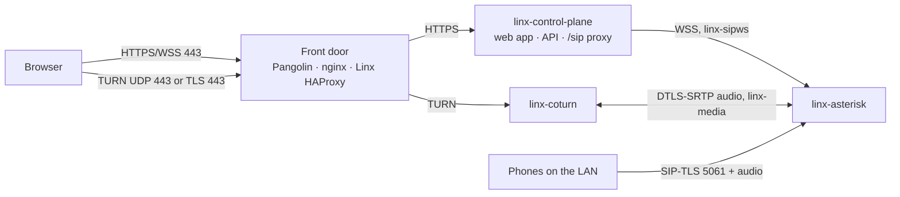

# Linx — Web client and front door (Phase 1C)

Status: **approved by the owner 2026-09-24** (ADR-036 to ADR-041). Owner decisions so far: simple accounts now (ADR-036), every front door designed and NAT-friendly with Pangolin built first (ADR-040), open-source Opus add-on (ADR-041).
Third slice of Phase 1 (`docs/ROADMAP.md`). People sign in at a web address and make and take calls in the browser, from home or from anywhere, including networks that block everything except web traffic. Trunks (1D) and the admin portal (1E) come later.

## 1. In plain words
- **People accounts.** An admin creates a person (name, email, role, extension) and gets a one-time link to hand over. The person opens it, picks a password and, for admins, sets up an authenticator app. Company sign-in (Google/Microsoft) and passkeys come with the admin portal in 1E.
- **The web client** is a page at `meet.<domain>`: sign in, dial, answer, mute, keypad, hang up, and see who in the team is online. It can be installed like an app (PWA). In this slice it rings while the page is open. Ringing a closed page needs push notifications (Phase 2).
- **Everything a browser needs goes through one web address.** The page, the API and the call connection all go through the control plane. Any front door (Pangolin, nginx, Caddy, Traefik, or Linx's own) can forward them like an ordinary website.
- **Audio from outside your home always goes through Linx's relay** (coturn, "TURN"). The relay runs next to Asterisk and talks to it inside the server. The router or proxy only needs **port 443**: TCP, plus UDP 443 when possible (better for audio). No range of audio ports is forwarded, and no public IP is configured anywhere. A changing home IP only needs the DNS record updated.
- **Opus**, the audio format browsers and iPhones use, now works end to end: an open-source Opus converter is built into Linx's Asterisk image, so messages and the echo test work in Opus too, and calls cope better with bad connections.
- **Phone port 5061 stays home-only.** Browsers never use it. It opens to the internet only when desk phones or trunks need it, with its own lockout (1D/Phase 2).

## 2. What runs

| Piece | Choice |
|---|---|
| Web page, API, `/sip` | Served by the **control plane** on one HTTPS port (8443, certd's certificate). The web app is built into the control-plane image, so there's no separate `linx-web` container for now (ADR-037). All HTTP hostnames (`meet.`, `api.`, later `admin.`) reach this one port. The browser uses its own origin for `/api/v1` and `/sip`, so cookies stay same-origin and no cross-origin requests are allowed. |
| Browser → Asterisk | JsSIP opens `wss://meet.<domain>/sip`. The control plane checks the session cookie and `Origin`, then relays the websocket to Asterisk's internal websocket transport (ADR-038). Asterisk's HTTP server is turned on **only** for that, bound to a new internal network `linx-sipws` shared by the control plane and Asterisk alone, with TLS from step-ca (24 h, reloaded by the entrypoint's certificate watcher). |
| Relay | New container `linx-coturn`, official `coturn/coturn` image pinned by digest (4.18.x) (ADR-039). Listens on UDP 443 and TLS 443 (TLS with certd's certificate for `turn.<domain>`). Relays only to Asterisk's address on a new internal network `linx-media` (every other address is denied, including the LAN, the internet and other containers). Short-lived credentials from the control plane (HMAC "TURN REST", 1 h), non-root, read-only. |
| Asterisk for browsers | New device kind `web`: `webrtc=yes` (ICE, DTLS-SRTP, rtcp-mux, AVPF), `dtls_auto_generate_cert`, codecs `opus,g722,ulaw` (Opus first for everyone again, reversing migration 0009's workaround). |
| Opus | Wazo's open-source `codec_opus` (fork of `traud/asterisk-opus`, GPLv2 like Asterisk; libopus is BSD), compiled into the Asterisk image from a pinned commit with its SHA-256 (ADR-041). Prompts are stored as Opus too, so playing them to an Opus caller needs no conversion. |

**Audio path.** A browser at home can send audio straight to Asterisk on the LAN (published LAN-only ports, as in 1B). A browser outside gets no direct route (the audio ports aren't forwarded, on purpose), so ICE picks the relay: browser ⇄ coturn over UDP 443, or over TLS 443 when UDP is blocked; coturn ⇄ Asterisk inside the server. The relay's addresses are internal Docker addresses, so NAT, a dynamic IP or a Pangolin tunnel in between change nothing. Audio is DTLS-SRTP end to end between browser and Asterisk. coturn only passes encrypted packets.

## 3. Front doors (ADR-040)
`linx setup` asks one question: **"What sits in front of Linx on the internet?"** It generates the config for that answer, prints the router's port-forwards, and `linx doctor` checks the result. Each front door needs the same three things routed:

| Traffic | Needs |
|---|---|
| `meet.`, `api.` (HTTPS + websockets) | An ordinary HTTP(S) route to the control plane's port 8443 (HTTPS to the backend, never plain HTTP; the proxy checks Linx's certificate against the public name) |
| `turn.` TLS | TCP passthrough by name on 443 (no decryption), or its own TCP port when the proxy can't pass through |
| TURN UDP | UDP 443 (or 3478) straight to coturn |

| Answer | What setup generates | TURN/TLS on 443? |
|---|---|---|
| **Pangolin** (built first) | Plain-language steps (or API calls, if Pangolin's API is reachable) for: HTTP resources `meet.` and `api.` → Linx 8443, set to *public* with Pangolin's own sign-in off (Linx signs people in); a raw UDP resource 443 → coturn; a raw TCP resource → coturn TLS plus a Traefik `HostSNI` passthrough file so `turn.` works on 443. Checks HTTP/3 is off (it would take UDP 443). Works whether Pangolin runs at home or on a VPS with Newt. | Yes, via the Traefik file (proved in step 6; otherwise its own port) |
| **Linx takes 443** (home router forward, or a VPS) | `linx-sni` HAProxy (ADR-009) on TCP 443: `turn.` → coturn, everything else → control plane, with PROXY v2 so Linx sees real addresses. UDP 443 published on coturn. Router forwards: TCP+UDP 443. | Yes |
| **nginx / HAProxy** already on 443 | A `stream { ssl_preread }` map (`turn.` passthrough) plus HTTP server blocks for `meet.`/`api.`, and the router/firewall list. | Yes |
| **Caddy / Traefik / other HTTP-only proxy** | HTTP routes for `meet.`/`api.`; coturn TLS gets its own port (5349), forwarded directly. | No: TURN/TLS on 5349 (fine except on networks that allow only 443) |
| **Home network only** | Nothing public. DNS names point at the LAN address. | n/a |

- **Real addresses** (for sign-in lockout): Linx trusts `X-Forwarded-For` or PROXY v2 only from the front door's own address (`LINX_TRUSTED_PROXIES`, set by setup). coturn can't see real addresses behind a passthrough, so it relies on short-lived credentials and quotas (THREAT_MODEL).
- **DNS:** setup creates `meet.`, `api.`, `turn.` records with the DNS token certd already holds (Cloudflare/DuckDNS), pointing at the front door's public address. A home with a changing IP gets a small updater in certd that follows the public IP (records only; nothing inside Linx needs the public IP).
- **Certificates:** certd's wildcard certificate covers all names. coturn and the HAProxy front door read it from the `certs` volume and reload on renewal.

## 4. People accounts and sign-in (ADR-036)
- Migration adds `app_user` (tenant, email unique, name, role, extension, password hash, MFA secret sealed with ADR-030's key, recovery-code hashes, disabled, timestamps) and `user_session`.
- **First account:** `sudo linx user create --email ... --name ... --role admin [--extension 101]` prints a one-time set-password link (24 h). After that, admins use `POST /users` and `POST /users/{id}/setup-link`. Links are single-use and stored hashed. Email delivery comes with email sending (later in Phase 1).
- **Passwords:** at least 12 characters, checked against a bundled list of common passwords; stored with Argon2id (`golang.org/x/crypto/argon2`, BSD).
- **Authenticator app (TOTP, RFC 6238):** required for `admin`/`system_admin`, optional for `user`. 10 single-use recovery codes. Written with the Go standard library (HMAC-SHA1, ±1 step, each code usable once).
- **Sessions** (as `docs/API.md` §3 already specifies): cookie `__Host-linx_session` (`HttpOnly`, `Secure`, `SameSite=Strict`, random 256 bits, stored hashed); CSRF token in a header on every write. User sessions last 30 days (7 days idle). Admin sessions last 12 hours and need the authenticator code at every sign-in. Signing out, disabling the person or changing the password ends their sessions and closes their live call connections.
- **Lockout:** the existing per-address limit (20 failed sign-ins/min, IPv6 per /64), plus per account: after 5 failures, each further try waits (1 min, doubling, up to 1 h). The right password during the wait still fails. The admin alert "someone is guessing passwords for <person>" fires after 20 failures in an hour. Messages never reveal whether an email exists.
- **API:** `POST /session` (sign in, then `POST /session/mfa`), `DELETE /session`, `GET /me` (now also returns the person and their extension), `/users` CRUD (`users:read|write`; `users:write` is sensitive), `/me/password`, `/me/mfa`. A session's scopes come from the person's role, exactly like an API key's ceiling.

## 5. The browser's phone line (ADR-038)
1. After sign-in, the page calls `POST /me/web-phone`. The control plane creates (or refreshes) a `web` device for the person's extension, **tied to this session**, with a fresh random SIP password, and returns it with the SIP settings and TURN credentials. The password lives only in the page's memory (never `localStorage`) and dies with the session. Stale web devices are revoked when their session ends.
2. JsSIP opens `wss://meet.<domain>/sip`. The control plane accepts the websocket only with a valid session cookie and an `Origin` equal to its own address. It then relays the websocket to Asterisk.
3. **Registration lockout, where public SIP now lives:** the relay reads each SIP message's first line and a few headers. It allows only requests from this session's own web device (any other username: the connection is closed and audited). It closes the connection after 3 failed authentications. It caps message rate and size (e.g. 20 messages/s, 64 KB). A person's web devices are revoked when their account is disabled. The raw 5061 port stays LAN-only, so there is no unauthenticated SIP on the internet at all.
4. `GET /me/turn-credentials` refreshes TURN credentials before they expire (1 h). The username embeds expiry and person id, so the relay can apply per-person quotas (bandwidth, 10 allocations).

## 6. Web client
- React + TypeScript + Vite, shadcn/ui + Radix (ADR-004), design tokens from `docs/ui/linx-tokens.json`, brand Cobalt. **JsSIP 3.13.x** (ADR-017 re-verified: MIT, active, 3.13.8 in May 2026). API calls with `openapi-fetch` from `api/openapi.yaml` (ADR-025).
- **Screens in this slice** (low-fidelity specs in `docs/ui/` for owner approval before any UI code; layout per "Web · Console & presence"): sign-in (+ authenticator code, first-time password + authenticator setup); app shell with sidebar (Dialer, Team; the rest greyed until built); dialer; incoming call; active call panel (name, timer, mute, keypad, end; connection chip "Direct"/"Relayed" with round-trip time); Team list (extensions with online/on-a-call from the existing ARI state, via a small events websocket); settings (microphone, speaker, ringtone volume, test sound = `*43`).
- Opus with in-band FEC and DTX (the low-bandwidth rules in the brief). The ICE order is direct, then TURN/UDP 443, then TURN/TLS 443. Reconnects on network change (ICE restart).
- Pages load fast: the web client bundle is split so the sign-in page is small. The strict budget (<300 KB) is for the guest page in Phase 3.
- Strict Content-Security-Policy (no inline scripts, `connect-src 'self'`), `Permissions-Policy` (microphone only on this origin), HSTS.

## 7. Security in this slice
- New public surfaces: sign-in, the `/sip` relay (session-bound), TURN (credential-bound, relays to Asterisk only). THREAT_MODEL gets rows for sessions, the relay, coturn and each front door at the review step.
- Precondition from 1B met differently than planned: "registration lockout before public SIP" becomes "only signed-in, session-bound SIP is public" (relay checks + lockout), with 5061 still LAN-only.
- coturn `denied-peer-ip` covers every range except Asterisk's `linx-media` address; `no-multicast-peers`, `no-cli`, `no-tcp-relay`, quotas, `fingerprint`, TLS 1.2+. Credential secret is a new Docker secret `linx_turn_secret`.
- `Cache-Control: no-store` (already on every API response) covers the web-phone password.

## 8. Build order (one session each)
1. **Screen specs:** low-fidelity specs for the screens in §6, in `docs/ui/`, for owner approval (UI rule in ROADMAP). *(Sonnet)*
2. **Asterisk for browsers + Opus:** Wazo `codec_opus` in the image (pinned, both architectures; if it won't build or pass on Asterisk 22, fall back to G.722 and tell the owner), Opus prompts, `web` device kind (migration), HTTPS websocket transport on `linx-sipws` with a step-ca certificate, codec order back to Opus first. Call suite: Opus-only caller hears the prompt. *(Opus: native build risk)*
3. **People accounts:** migration, Argon2id, TOTP, sessions + CSRF, lockout + alert, `/session`, `/users`, `/me*`, `linx user create`. *(Sonnet; security review of it in step 9)*
4. **Browser phone line + relay:** `/me/web-phone`, the `/sip` relay with its checks and lockout, `linx-coturn` (compose, rendered config, `linx_turn_secret`, `linx-media`), `/me/turn-credentials`, doctor checks for coturn. *(Opus: hardest integration)*
5. **Web client:** the screens from step 1, JsSIP, Playwright screenshots against `docs/ui`. Automated call test: two headless Chromium browsers with fake microphones call each other through the real stack **with UDP blocked** (TURN/TLS), plus browser → SIPp softphone. *(Sonnet)*
6. **Front door: Pangolin + Linx-takes-443:** setup's question, generated Pangolin steps and Traefik file, `linx-sni` HAProxy, trusted proxies, DNS records, doctor checks (names resolve, 443 reaches each backend, UDP 443 reaches coturn, TURN/TLS works). Proves TURN/TLS on 443 through Pangolin. *(Sonnet)*
7. **Front door: nginx, HTTP-only proxies, home-only + IP follower:** the remaining generators, a Docker test per front door (real nginx/Traefik containers), and certd's DNS updater for changing home IPs. *(Sonnet)*
8. **Security review + docs:** threat model, `docs/DEMO_PHASE1C.md`. *(Opus)*

## 9. Demo exit (Phase 1C)
Through **Pangolin**: `linx doctor` all green; create a person and sign in at `meet.<domain>` on a laptop at home and on a phone on mobile data; call each other and hear both ways; one side with UDP blocked still connects ("Relayed", TURN/TLS on 443); call a Linphone on the home Wi-Fi and back; `*43` echo in Opus; wrong passwords trigger the wait and the alert; signing out drops the phone line at once. Automated: the browser call suite (UDP blocked) and the SIPp suite are green in CI. The Phase 1 "web-to-trunk" part of the exit test comes with 1D.

## 10. Not in this slice
Push notifications for closed pages and PWA ringing (Phase 2); video; hold/transfer/park (Phase 4 call features); voicemail, call history/CDR (later Phase 1); company sign-in and passkeys, admin portal (1E); public 5061 for remote desk phones (with Asterisk-side lockout, when needed); trunks (1D).
