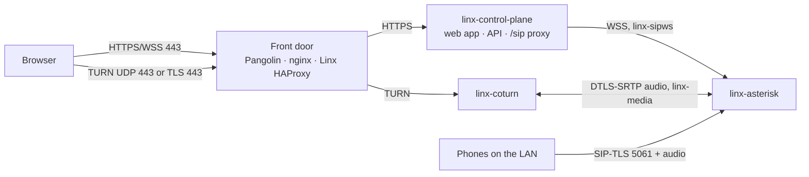

# Linx — Web client and front door (Phase 1C)

Status: **approved by the owner 2026-09-24** (ADR-036 to ADR-041). Owner decisions so far: simple accounts now (ADR-036), every front door designed and NAT-friendly with Pangolin built first (ADR-040), open-source Opus add-on (ADR-041).
Third slice of Phase 1 (`docs/ROADMAP.md`). People sign in at a web address and make and take calls in the browser, from home or from anywhere, including networks that block everything except web traffic. Trunks (1D) and the admin portal (1E) come later.

## 1. In plain words
- **People accounts.** An admin creates a person (name, email, role, extension) and gets a one-time link to hand over. The person opens it, picks a password and, for admins, sets up an authenticator app. Company sign-in (Google/Microsoft) and passkeys come with the admin portal in 1E.
- **The web client** is a page at `meet.<domain>`: sign in, dial, answer, mute, keypad, hang up, and see who in the team is online. It can be installed like an app (PWA). In this slice it rings while the page is open. Ringing a closed page needs push notifications (Phase 2).
- **Everything a browser needs goes through one web address.** The page, the API and the call connection all go through the control plane. Any front door (Pangolin, nginx, Caddy, Traefik, or Linx's own) can forward them like an ordinary website.
- **Audio from outside your home always goes through Linx's relay** (coturn, "TURN"). The relay runs next to Asterisk and talks to it inside the server. The router or proxy only needs **port 443**: TCP, plus UDP 443 when possible (better for audio). No range of audio ports is forwarded, and no public IP is configured anywhere. A changing home IP only needs the DNS record updated.
- **Opus**, the audio format browsers and iPhones use, now works end to end: an open-source Opus converter is built into Linx's Asterisk image, so messages and the echo test work in Opus too, and calls cope better with bad connections.
- **Phone port 5061 stays home-only.** Browsers never use it. It opens to the internet only when desk phones or trunks need it, with its own lockout (1D/Phase 2).

## 2. What runs

| Piece | Choice |
|---|---|
| Web page, API, `/sip` | Served by the **control plane** on one HTTPS port (8443, certd's certificate). The web app is built into the control-plane image, so there's no separate `linx-web` container for now (ADR-037). All HTTP hostnames (`meet.`, `api.`, later `admin.`) reach this one port. The browser uses its own origin for `/api/v1` and `/sip`, so cookies stay same-origin and no cross-origin requests are allowed. |
| Browser → Asterisk | JsSIP opens `wss://meet.<domain>/sip`. The control plane checks the session cookie and `Origin`, then relays the websocket to Asterisk's internal websocket transport (ADR-038). Asterisk's HTTP server is turned on **only** for that, bound to a new internal network `linx-sipws` shared by the control plane and Asterisk alone, with TLS from step-ca (24 h, reloaded by the entrypoint's certificate watcher). *As built (step 2):* `wss://linx-sipws:8089/ws`; HTTPS only (plain HTTP stays off), on Asterisk's `linx-sipws` address only (the entrypoint resolves its own alias `linx-sipws` there and binds that), and that network is the only one besides the LAN that Asterisk's SIP ACL lets in. The **control plane** issues the certificate (it already holds the `linx-services` provisioner for ARI) and writes it to `sipws-certs`, a memory-only volume Asterisk mounts read-only, so Asterisk holds no CA credential; the entrypoint runs `module reload http` when it changes (open websockets stay up). `linx doctor` checks the listener (one internal address, no port 8088). |
| Relay | New container `linx-coturn`, official `coturn/coturn` image pinned by digest (4.18.x) (ADR-039). Listens on UDP 443 and TLS 443 (TLS with certd's certificate for `turn.<domain>`). Relays only to Asterisk's address on a new internal network `linx-media` (every other address is denied, including the LAN, the internet and other containers). Short-lived credentials from the control plane (HMAC "TURN REST", 1 h), non-root, read-only. *As built (step 4):* image `linx-coturn` = the official 4.18.0 image unchanged plus a small Go entrypoint (`services/coturn-entrypoint`, `internal/turnconf`), built and signed in CI like the others. The entrypoint resolves Asterisk's alias `linx-asterisk-media` (on `linx-media` only), renders `turnserver.conf` into memory (the secret never appears on a command line): `denied-peer-ip` for every IPv4 and IPv6 address, `allowed-peer-ip` = Asterisk only, `relay-ip` = coturn's own `linx-media` address, `no-tcp-relay`, `no-multicast-peers`, quotas 10 allocations per person / 300 total / 64 kB/s each. It sends coturn `SIGUSR2` when certd renews the certificate, and exits (Docker restarts it) if Asterisk's address changes. Inside the container coturn listens on 3478 (UDP) and 5349 (TLS), unprivileged; the image's `turnserver` file capability is removed so it runs with no capabilities at all. No port is published on the server yet: each front door maps 443 to these (steps 6–7). Health check: answers STUN and serves exactly the deployed certificate. |
| Asterisk for browsers | New device kind `web`: `webrtc=yes` (ICE, DTLS-SRTP, rtcp-mux, AVPF), `dtls_auto_generate_cert`, codecs `opus,g722,ulaw` (Opus first for everyone again, reversing migration 0009's workaround). *As built (step 2, migration 0011):* each WebRTC setting is its own view column rather than `webrtc=yes`, so nothing depends on the order Asterisk applies them; the caller's codec order wins again. Which addresses Asterisk offers browsers for audio (ICE candidates) is set with the relay in step 4. |
| Opus | Wazo's open-source `codec_opus` (fork of `traud/asterisk-opus`, GPLv2 like Asterisk; libopus is BSD), compiled into the Asterisk image from a pinned commit with its SHA-256 (ADR-041). *As built (step 2):* Wazo's 26.09 release (commit `591b6cd`), only its codec file (Asterisk 22's own Opus SDP module is used), with a small Linx patch so it reads Opus settings through Asterisk's public API instead of a copy of an internal struct whose layout changed. Asterisk has no Opus *file* format, so prompts are stored in G.722 (wideband) instead of GSM and converted to Opus as they play. Builds on amd64 and arm64. |

**Which addresses Asterisk offers browsers** *(as built, step 4)*: its `linx-media` address (the relay's side) and the server's LAN address (browsers at home, straight to the published audio ports; it stands in for Asterisk's address on the network holding its default route, where Docker publishes them), through `rtp.conf`'s `ice_deny`/`ice_permit` and `[ice_host_candidates]` (`internal/asteriskconf`). Nothing else: no STUN/TURN of its own, no internal addresses. The call suite checks the offer a browser receives lists exactly those two.

**Audio path.** A browser at home can send audio straight to Asterisk on the LAN (published LAN-only ports, as in 1B). A browser outside gets no direct route (the audio ports aren't forwarded, on purpose), so ICE picks the relay: browser ⇄ coturn over UDP 443, or over TLS 443 when UDP is blocked; coturn ⇄ Asterisk inside the server. The relay's addresses are internal Docker addresses, so NAT, a dynamic IP or a Pangolin tunnel in between change nothing. Audio is DTLS-SRTP end to end between browser and Asterisk. coturn only passes encrypted packets.

## 3. Front doors (ADR-040)
`linx setup` asks one question: **"What sits in front of Linx on the internet?"** It generates the config for that answer, prints the router's port-forwards, and `linx doctor` checks the result. Each front door needs the same three things routed:

| Traffic | Needs |
|---|---|
| `meet.`, `api.` (HTTPS + websockets) | An ordinary HTTP(S) route to the control plane's port 8443 (HTTPS to the backend, never plain HTTP; the proxy checks Linx's certificate against the public name) |
| `turn.` TLS | TCP passthrough by name on 443 (no decryption), or its own TCP port when the proxy can't pass through |
| TURN UDP | UDP 443 (or 3478) straight to coturn |

| Answer | What setup generates | TURN/TLS on 443? |
|---|---|---|
| **Pangolin** (built first) | Plain-language steps (or API calls, if Pangolin's API is reachable) for: HTTP resources `meet.` and `api.` → Linx 8443, set to *public* with Pangolin's own sign-in off (Linx signs people in); a raw UDP resource 443 → coturn; a raw TCP resource → coturn TLS plus a Traefik `HostSNI` passthrough file so `turn.` works on 443. Checks HTTP/3 is off (it would take UDP 443). Works whether Pangolin runs at home or on a VPS with Newt. | Yes, via the Traefik file (proved in step 6; otherwise its own port) |
| **Linx takes 443** (home router forward, or a VPS) | `linx-sni` HAProxy (ADR-009) on TCP 443: `turn.` → coturn, everything else → control plane, with PROXY v2 so Linx sees real addresses. UDP 443 published on coturn. Router forwards: TCP+UDP 443. | Yes |
| **nginx / HAProxy** already on 443 | A `stream { ssl_preread }` map (`turn.` passthrough) plus HTTP server blocks for `meet.`/`api.`, and the router/firewall list. | Yes |
| **Caddy / Traefik / other HTTP-only proxy** | HTTP routes for `meet.`/`api.`; coturn TLS gets its own port (5349), forwarded directly. | No: TURN/TLS on 5349 (fine except on networks that allow only 443) |
| **Home network only** | Nothing public. DNS names point at the LAN address. | n/a |

*As built (step 6, Pangolin at home and Linx takes 443):*
- **Everything is passed through, nothing is decrypted by the front door.** Pangolin's Traefik never checks the certificate of the servers it forwards to (its generated transports set `insecureSkipVerify: true`, and so does its default static config), so an ordinary Pangolin HTTP resource couldn't keep ADR-040's "the proxy checks Linx's certificate". Instead `meet.` and `api.` go through by name exactly like `turn.`: TCP routers with `HostSNI(...)` and `tls.passthrough` on Pangolin's `websecure` entry point, which take precedence over its HTTP routers. Linx terminates TLS itself with certd's certificate (browsers see it end to end), and Traefik sends the visitor's address in a **PROXY protocol v2** header (a `serversTransport` with `proxyProtocol.version: 2`). No Pangolin dashboard resources are needed: the owner appends one generated block to Pangolin's `config/traefik/dynamic_config.yml` (`/etc/linx/front-door/pangolin-dynamic-config.yml`, with the steps in `/etc/linx/front-door/PANGOLIN.txt`). "Linx takes 443" does the same with `linx-sni` (HAProxy 3.2 LTS, TCP mode, `req_ssl_sni`, `send-proxy-v2` to the control plane, Docker's DNS re-resolved at run time; setup writes `/etc/linx/haproxy.cfg`; compose profile `linx-443`). HTTP-only proxies (step 7) will need something else.
- **PROXY protocol on 8443** (`services/control-plane/frontdoor.go`, `github.com/pires/go-proxyproto`, Apache-2.0): from an address in `LINX_TRUSTED_PROXIES` the header is **required**; from anyone else a header is **refused** (so nobody can claim another address to dodge the sign-in lockout). `LINX_TRUSTED_PROXIES` takes addresses, networks or names; names (`linx-sni`) are looked up every 30 s, every 2 s while one can't be found.
- **Pangolin at home, no Newt** (the owner's setup): setup asks for the Pangolin machine's home address. The control plane's 8443 and coturn's 5349 are published on the LAN address, and the firewall table lets only Pangolin reach them (set `front_door`). **UDP 443** is forwarded by the router straight to the Linx server (coturn publishes LAN:443/udp), not through Pangolin, which doesn't use it. Some routers (UniFi) refuse a UDP 443 forward to one machine while TCP 443 goes to another: setup then asks for another UDP port (`front_door.turn_udp_port`, 3478 recommended; Pangolin, nginx and HTTP-only proxies): coturn is published on LAN:3478/udp, browsers get `turn:turn.<domain>:3478?transport=udp` (TURN over TLS stays on 443), and the generated steps and doctor use that port. Owner's UniFi, found in the Phase 1C demo. Pangolin on a VPS (with Newt, and a raw UDP resource) is designed but not built.
- **DNS:** `linx-certd -records meet,api,turn` (setup's last step) points the names at this network's public address, found from Cloudflare's own `https://1.1.1.1/cdn-cgi/trace`: Cloudflare A records (never proxied; a name that is a CNAME is left alone) or the DuckDNS update. The changing-IP follower is step 7.
- **HTTP/3:** Pangolin's Traefik advertises it by default; the steps say to turn it off, since UDP 443 now goes to Linx.
- **`linx doctor`** ("Calls from outside"): each public name reaches Linx through the front door with certd's own certificate (proving pass-through), a relay allocation succeeds over TLS on 443 through it (`internal/turn` client, credentials from `linx_turn_secret`), coturn answers STUN on UDP 443, the names resolve to one public address, and (Pangolin) only Pangolin may reach the web port. The router's forwards can't be seen from inside.
- **Proved** by the browser suite (`make test-browser`), now run behind each front door: Pangolin's Traefik 3.7 with its shipped static config (HTTP/3 off, its global `insecureSkipVerify` left on to show nothing depends on it) plus the generated block unchanged, and the real `linx-sni`. Browsers use `https://meet.linx.test` on 443; the UDP-blocked browser's audio goes over TURN/TLS on 443 through the front door.
*As built (step 7, the other front doors and the IP follower):*
- **nginx or HAProxy already on 443** (`front_door.kind: nginx`, `proxy_address` = that machine, this server's own address if it runs here): the same pass-through by name with PROXY v2. Setup writes `/etc/linx/front-door/nginx-stream.conf` (a `stream { map $ssl_preread_server_name ... }` block; nginx sends PROXY from its one 443 listener, and since coturn can't read it, `turn.` goes through a local hop on `127.0.0.1:4445` that drops it; the owner's own HTTPS sites move to `127.0.0.1:4443` with `proxy_protocol` and `real_ip_header proxy_protocol`), `haproxy-linx.cfg` (two backends and two `use_backend` lines) and `NGINX-HAPROXY.txt`.
- **HTTP-only proxies** (`http-proxy`: Caddy, Nginx Proxy Manager, others): they can't pass TLS through, so they decrypt and re-encrypt to Linx, and must check Linx's certificate (a trusted one: they won't accept Let's Encrypt test certificates). Setup writes a Caddy block (`reverse_proxy https://<linx>:8443` with `tls_server_name meet.<domain>` and `header_up Host {host}`: Caddy would otherwise send Linx's address as Host, and the websockets' same-origin check would refuse it) and `HTTP-PROXY.txt` (Caddy, Nginx Proxy Manager with `proxy_ssl_verify on`, anything else). Linx believes the proxy's `X-Forwarded-For` (`LINX_PROXY_PROTOCOL=false`: a PROXY header is then refused from everyone). TURN over TLS gets its own port: the router forwards TCP 5349 straight to Linx (`LINX_TURN_URLS` = `turn.<domain>:443` UDP, `turns:turn.<domain>:5349`), and the firewall leaves 5349 open.
- **Home only** (`home-only`): `linx-sni` on the LAN address's 443, the names point at the LAN address (`certd -records ... -address <LAN>`): `https://meet.<domain>` at home with no router changes; audio goes straight to Asterisk. **`none`** (the default) publishes nothing.
- **IP follower** (`internal/certs.Follower`, in linx-certd when `LINX_DNS_RECORDS` is set, which setup does for every front door but `none`): every 5 minutes it asks Cloudflare's trace for this network's public address (or uses `LINX_DNS_ADDRESS`, home only) and rewrites the records only when it changed; it re-reads them every 6 hours, and retries a minute after a failure. It only ever changes Cloudflare records Linx made (comment starting `Linx`): one the owner typed in by hand is reported and left alone (step 8 review; `linx setup`'s one-off run may still take a name over, since the owner just asked for it). `/metrics`: `linx_dns_records_last_update_timestamp_seconds`, `linx_dns_records_failures_total`.
- **Doctor:** per front door. For an HTTP-only proxy it fetches Linx's `/healthz` through the proxy (the proxy's own certificate, checked against the system's roots) and checks the relay's TLS on 5349; for home-only, that the names point at this server.
- **Proved:** the browser suite runs behind four front doors in CI: Pangolin's Traefik, a real nginx with the generated stream block, a real Caddy with the generated block (trusting the test CA for Linx's certificate), and `linx-sni`.
- **Real addresses** (for sign-in lockout): Linx trusts `X-Forwarded-For` or PROXY v2 only from the front door's own address (`LINX_TRUSTED_PROXIES`, set by setup), and never `X-Forwarded-For` when front doors use PROXY v2 (they pass TLS through, so that header could only be the visitor's own). coturn can't see real addresses behind a passthrough, so it relies on short-lived credentials and quotas (THREAT_MODEL).
- **DNS:** setup creates `meet.`, `api.`, `turn.` records with the DNS token certd already holds (Cloudflare/DuckDNS), pointing at the front door's public address. A home with a changing IP gets a small updater in certd that follows the public IP (records only; nothing inside Linx needs the public IP).
- **Certificates:** certd's wildcard certificate covers all names. coturn and the HAProxy front door read it from the `certs` volume and reload on renewal.

## 4. People accounts and sign-in (ADR-036)
- Migration adds `app_user` (tenant, email unique, name, role, extension, password hash, MFA secret sealed with ADR-030's key, recovery-code hashes, disabled, timestamps) and `user_session`.
- **First account:** `sudo linx user create --email ... --name ... --role admin [--extension 101]` prints a one-time set-password link (24 h). After that, admins use `POST /users` and `POST /users/{id}/setup-link`. Links are single-use (claimed atomically) and stored hashed. A link also resets a lost password: using it ends the person's other sessions, and a person who has an authenticator app still needs its code (a link never skips it). An admin can't issue a link for, change or disable someone whose role they couldn't grant (a `system_admin`). Email delivery comes with email sending (later in Phase 1).
- **Passwords:** at least 12 characters, checked against a bundled list of common passwords; stored with Argon2id (`golang.org/x/crypto/argon2`, BSD).
- **Authenticator app (TOTP, RFC 6238):** required for `admin`/`system_admin`, optional for `user`. 10 single-use recovery codes. Written with the Go standard library (HMAC-SHA1, ±1 step, each code usable once).
- **Sessions** (as `docs/API.md` §3 already specifies): cookie `__Host-linx_session` (`HttpOnly`, `Secure`, `SameSite=Strict`, random 256 bits, stored hashed); CSRF token in a header on every write. User sessions last 30 days (7 days idle). Admin sessions last 12 hours and need the authenticator code at every sign-in. Signing out, disabling the person or changing the password ends their sessions and closes their live call connections. A session still waiting on its authenticator code (or first-run enrollment) lasts 15 minutes and can do nothing but finish signing in: it can't start a new authenticator enrollment once the account has one, or change the password (step 8 review). `POST /session` and `POST /setup-links/{token}` take only `application/json` (415 otherwise), so another site can't sign a visitor in with a form post.
- **Lockout:** the existing per-address limit (20 failed sign-ins/min, IPv6 per /64), plus per account: after 5 failures, each further try waits (1 min, doubling, up to 1 h). The right password during the wait still fails. The admin alert "someone is guessing passwords for <person>" fires after 20 failures in an hour, tries during the wait included (they don't lengthen it; step 8 review: the waits alone allowed only about 10 counted failures an hour, so the alert could never fire). A wrong email and a wrong password get the same answer in the same time; only the lockout's own "try again after" answer shows that an account exists (THREAT_MODEL residual risks).
- **API:** `POST /session` (sign in, then `POST /session/mfa`), `DELETE /session`, `GET /me` (now also returns the person and their extension), `/users` CRUD (`users:read|write`; `users:write` is sensitive), `/me/password`, `/me/mfa`. A session's scopes come from the person's role, exactly like an API key's ceiling.

## 5. The browser's phone line (ADR-038)
1. After sign-in, the page calls `POST /me/web-phone`. The control plane creates (or refreshes) a `web` device for the person's extension, **tied to this session**, with a fresh random SIP password, and returns it with the SIP settings and TURN credentials. The password lives only in the page's memory (never `localStorage`) and dies with the session. Stale web devices are revoked when their session ends.
2. JsSIP opens `wss://meet.<domain>/sip`. The control plane accepts the websocket only with a valid session cookie and an `Origin` equal to its own address. It then relays the websocket to Asterisk.
3. **Registration lockout, where public SIP now lives:** the relay reads each SIP message's first line and a few headers. It allows only requests from this session's own web device (any other username: the connection is closed and audited). It closes the connection after 3 failed authentications. It caps message rate and size (e.g. 20 messages/s, 64 KB). A person's web devices are revoked when their account is disabled. The raw 5061 port stays LAN-only, so there is no unauthenticated SIP on the internet at all.
4. `GET /me/turn-credentials` refreshes TURN credentials before they expire (1 h). The username embeds expiry and person id, so the relay can apply per-person quotas (bandwidth, 10 allocations).

*As built (step 4):*
- **The line belongs to the session in the database** (migration `0013_web_phone.sql`): `device.user_session_id`, one live line per session (unique index), and a `device_live` view every realtime view now reads. A web device is visible to Asterisk only while its session is unrevoked, unexpired (absolute and idle), past its authenticator code, its person not disabled and still on that extension. So signing out, disabling the person, a password or role change, or a moved extension ends the line in Asterisk on its very next lookup, whatever the control plane is doing. The control plane then marks such devices revoked (with `device.revoked`) at once for the ends it causes (`auth.Accounts.SessionsEnded`) and every 30 s for expiries. `POST /me/web-phone` reuses the session's line (same username, new password, no event) or, if the person's extension changed, revokes it and makes a new one (`device.created`). The admin device API shows web lines but refuses `reset-password` on them (409 `device_is_web`).
- **The relay** (`internal/siprelay`, `services/control-plane/sip.go`, `GET /sip`): cookie session (not pending), `Origin` exactly `https://<Host>`, the session must have a line (409 `no_phone_line` otherwise); then it dials `wss://linx-sipws:8089/ws` (internal CA checked) and relays messages unchanged. Browser→Asterisk requests: method allowlist (REGISTER, INVITE, ACK, BYE, CANCEL, OPTIONS, INFO, UPDATE, PRACK, MESSAGE, NOTIFY, SUBSCRIBE, REFER), exactly one `From` whose user is the line's username byte for byte (no unescaping: any other spelling is refused), the same for `To` on REGISTER and for every `Authorization`/`Proxy-Authorization` username. Anything else, a non-SIP message, over 64 KB, or more than 20 messages/s (burst 40) closes the connection (close code 1008 with the reason) and writes an audit entry `sip.relay_closed`. Three consecutive 401/407 answers to credentialed requests close it too (a `stale=true` challenge isn't counted; a 2xx resets the count). The session is re-read every 15 s (which also keeps it from going idle while the page is open); one connection per session (a new one replaces the old). Each browser frame must be exactly one SIP message (step 8 review): headers end in CRLF only (no bare CR or LF) and the body is exactly `Content-Length` bytes, so nothing Asterisk reads can hide from these checks.
- **Relay credentials** (`internal/turn`): secret `linx_turn_secret` (52 base32 characters, installer-generated); `LINX_TURN_URLS` overrides the default `turn:turn.<domain>:443?transport=udp,turns:turn.<domain>:443?transport=tcp` (the front-door steps set it).
- *Step 5:* the control plane now serves HTTPS on 8443 (see §6 "As built"), so browsers reach `/sip`. The browser sets its SIP contact's user part to the line's own username (JsSIP `contact_uri`): Asterisk dials that contact, so requests a browser sends inside a call it *answered* (an ICE-restart re-INVITE, say) are `From` its own username too, and the relay's strict rule holds for both sides of a call.

## 6. Web client
- React + TypeScript + Vite, shadcn/ui + Radix (ADR-004), design tokens from `docs/ui/linx-tokens.json`, brand Cobalt. **JsSIP 3.13.x** (ADR-017 re-verified: MIT, active, 3.13.8 in May 2026). API calls with `openapi-fetch` from `api/openapi.yaml` (ADR-025).
- **Screens in this slice** (low-fidelity specs in `docs/ui/` for owner approval before any UI code; layout per "Web · Console & presence"): sign-in (+ authenticator code, first-time password + authenticator setup); app shell with sidebar (Dialer, Team; the rest greyed until built); dialer; incoming call; active call panel (name, timer, mute, keypad, end; connection chip "Direct"/"Relayed" with round-trip time); Team list (extensions with online/on-a-call from the existing ARI state, via a small events websocket); settings (microphone, speaker, ringtone volume, test sound = `*43`).
- Opus with in-band FEC and DTX (the low-bandwidth rules in the brief). The ICE order is direct, then TURN/UDP 443, then TURN/TLS 443. Reconnects on network change (ICE restart).
- Pages load fast: the web client bundle is split so the sign-in page is small. The strict budget (<300 KB) is for the guest page in Phase 3.
- Strict Content-Security-Policy (no inline scripts, `connect-src 'self'`), `Permissions-Policy` (microphone only on this origin), HSTS.

*As built (step 5):*
- **HTTPS 8443** (ADR-037): the control plane serves the web client, the API, `/sip` and the Team websocket on `:8443` with certd's certificate, re-read on the first handshake after a renewal (`internal/certs.ServingCert`). Plain HTTP exists only on the container's own loopback (`127.0.0.1:8080`, `/healthz` for the Docker health check), which also checks that 8443 serves exactly the deployed certificate. Nothing publishes 8443 on the host yet: the front-door steps (6–7) route to it. Every response carries HSTS, the CSP above (`internal/webapp`), `Permissions-Policy` (microphone and speaker choice for this origin only), `X-Frame-Options: DENY`, `Referrer-Policy: no-referrer`, `nosniff`. Hashed build files are cached for a year; the app's own paths (`/`, `/team`, `/settings`, `/setup/<token>`) get `index.html`, revalidated each load.
- **Image:** `deploy/docker/control-plane.Dockerfile` builds `web/` (Node, pinned by digest) and copies `dist/` to `/usr/share/linx/web` in the control-plane image (`LINX_WEB_DIR`). The sign-in page loads alone; everything after sign-in (JsSIP, the screens) is a separate chunk, and so is the QR-code library.
- **Team list** (`GET /api/v1/team`, scope `team:read`, which every role now holds): one row per extension, named after the first enabled person on it (else the extension's own name), with a status: on a call or ringing (from the ARI call tracker) beats the person's chosen status, which beats whether a phone is signed in. **Live updates:** `GET /api/v1/team/live`, a websocket (subprotocol `linx.team.v1`) for signed-in browser sessions from this origin only, sends the whole list at once and again whenever it changes (the call tracker, a status change, or a 15 s refresh); it closes when the session ends (checked every 30 s). One session may have 8 open at once (429 `too_many_open` after that). **Set status:** `PUT /api/v1/me/presence` (Available / Away / Do not disturb; migration `0014_presence.sql`). Do not disturb also stops the person's extension ringing (callers hear "not available"), and queues `presence.changed`. `GET /me` now includes the person's extension number and status.
- **Client** (`web/src`): React + Vite + Tailwind with shadcn/ui components whose colours map only to `design/tokens.json` (`src/styles/app.css`). `openapi-fetch` with types generated from `api/openapi.yaml` by `make api` (`tools/openapi-ts`, its own package because `openapi-typescript` needs TypeScript 5's JavaScript API; the generated `web/src/api/schema.d.ts` is committed and `make lint` fails if it's stale). The phone line (`src/phone/line.ts`, JsSIP 3.13.8): registers over `/sip`; the SIP password lives only in memory; Opus gets in-band FEC and DTX in every offer/answer (`src/phone/sdp.ts`); ICE uses the browser's own order (direct, then the relay over UDP, then TLS); it sends its offer/answer as soon as it has a relay candidate (Asterisk takes no trickled candidates), at most 3 s after the first candidate; the chip reads Direct/Relayed and the round-trip time from `getStats` every 2 s; ICE restart when the connection drops for 3 s, fails, or the browser comes back online; relay credentials are refreshed 5 minutes before they expire; one call at a time (a second caller gets busy). Not "max-bundle": Asterisk's offers have no BUNDLE group, which max-bundle refuses. Caller names come from the Team list. Settings (microphone, speaker, ring volume) are kept per browser in `localStorage`; the ring is Web Audio, no sound file.
- **Asterisk fix found by the browser suite:** the `transport-wss` object now binds `0.0.0.0:8089` (it still listens on nothing; http.conf's listener on `linx-sipws` is the only one). Asterisk binds a call's audio to its transport's address, so the old `linx-sipws` bind made every packet to the relay leave with the wrong source address and coturn dropped it. And Asterisk's entrypoint now waits (up to 2 min) for the browser-websocket certificate before starting Asterisk, whose web server otherwise never starts if the control plane was a moment late (`docs/ops/CERT_RELOAD.md`).
- **Tests:** `make screens` (Playwright, `web/e2e/screens.spec.ts`: every screen in light, dark and phone width against a stand-in server with a fake SIP registrar; used to compare with `docs/ui`). `make test-browser` (`internal/browsertest`, in CI's amd64 Asterisk job): the real `compose.yaml` (certd replaced by a test certificate for `*.linx.test`, the internal CA bootstrapped as setup does), two people set their passwords from their links in two headless Chromiums (Playwright's container), see each other live on the Team list, call each other with one browser's UDP blocked (Chromium's `disable_non_proxied_udp` policy: its only route is the relay over TLS, which the test asserts, `relayProtocol: tls`) and both receive audio; mute, keypad, hang up; a browser calls a SIPp softphone over TLS; the Opus echo test plays back; signing out shows the person offline at once.

## 7. Security in this slice
- New public surfaces: sign-in, the `/sip` relay (session-bound), TURN (credential-bound, relays to Asterisk only). THREAT_MODEL gets rows for sessions, the relay, coturn and each front door at the review step.
- Precondition from 1B met differently than planned: "registration lockout before public SIP" becomes "only signed-in, session-bound SIP is public" (relay checks + lockout), with 5061 still LAN-only.
- coturn `denied-peer-ip` covers every range except Asterisk's `linx-media` address; `no-multicast-peers`, `no-cli`, `no-tcp-relay`, quotas, `fingerprint`, TLS 1.2+. Credential secret is a new Docker secret `linx_turn_secret`.
- `Cache-Control: no-store` (already on every API response) covers the web-phone password.

## 8. Build order (one session each)
1. ✅ **Screen specs** (done 2026-09-24): low-fidelity specs for the screens in §6, in `docs/ui/`, for owner approval (UI rule in ROADMAP). *(Sonnet)*
2. ✅ **Asterisk for browsers + Opus** (done 2026-09-24): Wazo `codec_opus` in the image (pinned, both architectures; if it won't build or pass on Asterisk 22, fall back to G.722 and tell the owner), Opus prompts, `web` device kind (migration), HTTPS websocket transport on `linx-sipws` with a step-ca certificate, codec order back to Opus first. Call suite: Opus-only caller hears the prompt. *(Opus: native build risk)*
3. ✅ **People accounts** (done 2026-09-24): migration, Argon2id, TOTP, sessions + CSRF, lockout + alert, `/session`, `/users`, `/me*`, `linx user create`. *(Sonnet; security review of it in step 9)*
4. ✅ **Browser phone line + relay** (done 2026-09-25): `/me/web-phone`, the `/sip` relay with its checks and lockout, `linx-coturn` (compose, rendered config, `linx_turn_secret`, `linx-media`), `/me/turn-credentials`, doctor checks for coturn. *(Opus: hardest integration)*
5. ✅ **Web client** (done 2026-09-25; §6 "As built", with HTTPS 8443 folded in by the owner's decision): the screens from step 1, JsSIP, Playwright screenshots against `docs/ui`. Automated call test: two headless Chromium browsers with fake microphones call each other through the real stack **with UDP blocked** (TURN/TLS), plus browser → SIPp softphone. *(Sonnet)*
6. ✅ **Front door: Pangolin + Linx-takes-443** (done 2026-09-25; §3 "As built": passthrough + PROXY v2 instead of Pangolin HTTP resources, Pangolin at home without Newt): setup's question, generated Pangolin steps and Traefik file, `linx-sni` HAProxy, trusted proxies, DNS records, doctor checks (names resolve, 443 reaches each backend, UDP 443 reaches coturn, TURN/TLS works). Proves TURN/TLS on 443 through Pangolin. *(Sonnet)*
7. ✅ **Front door: nginx, HTTP-only proxies, home-only + IP follower** (done 2026-09-25; §3 "As built", step 7): the remaining generators, a Docker test per front door (real nginx/Traefik containers), and certd's DNS updater for changing home IPs. *(Sonnet)*
8. ✅ **Security review + docs** (done 2026-09-25): `docs/THREAT_MODEL.md` "Phase 1C review", `docs/DEMO_PHASE1C.md`. *(Opus)*

## 9. Demo exit (Phase 1C)
Through **Pangolin**: `linx doctor` all green; create a person and sign in at `meet.<domain>` on a laptop at home and on a phone on mobile data; call each other and hear both ways; one side with UDP blocked still connects ("Relayed", TURN/TLS on 443); call a Linphone on the home Wi-Fi and back; `*43` echo in Opus; wrong passwords trigger the wait and the alert; signing out drops the phone line at once. Automated: the browser call suite (UDP blocked) and the SIPp suite are green in CI. The Phase 1 "web-to-trunk" part of the exit test comes with 1D.

## 10. Not in this slice
Push notifications for closed pages and PWA ringing (Phase 2); video; hold/transfer/park (Phase 4 call features); voicemail, call history/CDR (later Phase 1); company sign-in and passkeys, admin portal (1E); public 5061 for remote desk phones (with Asterisk-side lockout, when needed); trunks (1D).
